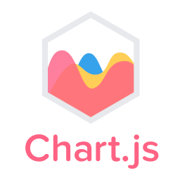

<h1 align="center">Hi there 👋, It's me Haseeb Ullah</h1>

<h3 align="center" >Motivated and dynamic computer science professional with a strong commitment to continuous learning through the resolution of complex tasks. Seeking opportunities to collaborate with experienced developers and contribute valuable skills to impactful projects. </h3>
 

 🔭 I’m currently working on  **System Design | Design Patterns**. 

 👯 I’m looking to collaborate on **Full Stack| Blockchain | Machine Learning **. 

 💬 Ask me about **Full-Stack | System Design**. 

  🎉 Love to discuss **WEB3 | System Design | DevOps Automation**. 

  📫 How to reach me **
<b>
haseeb.se.dev@gmail.com
</b>** 

s
 

 
  
<h2 align="center">Connect with me:</h2>

 

<h2 align="center">Languages and Tools:</h2>

 
   

   
    

  </a>  

<a href="https://www.mongodb.com/" target="_blank" rel="noreferrer"> 

 

  
 

 
<h2 align="center">🏆 GitHub Stats</h2>

  
  

  

  

