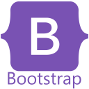

<!--
have to design the banner

-->

<h1 align="center">Hi there 👋, It's me Haseeb Ullah</h1>

<h4 align="center"> I am highly motivated and energetic Computer Science student who believe in learning by solving challenging tasks, through online platforms and working among expert developers. Eager to perform valuable work using computer programming skills. </h4>

 🔭 I’m currently working on  **Full Stack | Web3**. 

 👯 I’m looking to collaborate on **JAVA | MERN**. 

 💬 Ask me about **JAVA | MERN**. 

  🎉 Love to discuss **WEB3 | CI/CD**. 

  📫 How to reach me **haseebabbasi00@gmail.com** 

<!-- Skills: Linux | Java | Spring Boot | Spring | JavaScript | NodeJS | React | C Family | Python | Docker
-->
 

 
  
<h2 align="center">Connect with me:</h2>

<h2 align="center">Languages and Tools:</h2>

                   

<h2>🏆 Github Stats</h2>

 
  
  
    

 
**Visitors Count** 

   
 ✌

